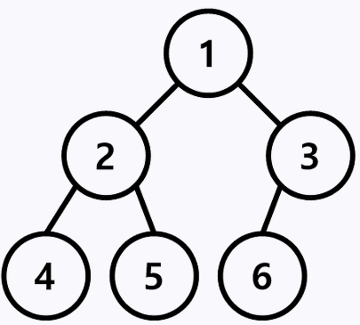

## Brute-force(완전 탐색)

- 생각할 수 있는 모든 경우의 수를 나열해보고 확인하는 기법
- 가장 기본적인 접근 방법: `해가 존재할 것으로 예상되는 모든 영역을 전체 탐색하는 방법`
- 해가 하나 이상 존재한다는 가정을 세우고 모든 범위를 탐색하기 때문에 무조건 정답을 찾을 수 있다.

### 장점

- 알고리즘을 설계하고 구현하기 매우 쉽다.
- 복잡한 알고리즘 없이 빠르게 구현 가능하다.

### 단점

- 알고리즘의 실행시간이 매우 오래 걸린다.
- 메모리 효율면에서 매우 비효율적이다.

### 종류

- 크게 선형구조와 비선형 구조로 나뉜다.

#### 선형 구조:

- 선형(Linear) 자료구조란 하나의 자료 뒤에 하나의 자료가 존재하는 것
- 배열과 리스트, 스택, 큐 등이 있다.
- `알고리즘 종류: 순차 탐색`

#### 비선형 구조:

- 비선형(NonLinear) 자료구조란 하나의 자료 뒤에 여러 개의 자료가 존재할 수 있는 것
- 트리와 그래프가 대표적이다.
- `알고리즘 종류: DFS, 백트래킹, BFS`
