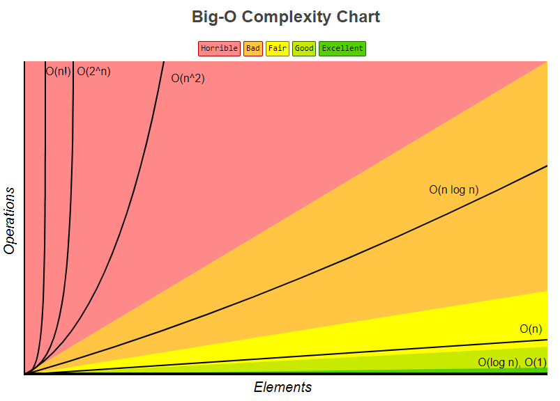

### 시간 복잡도란?

- 알고리즘의 성능을 설명하는 것
- 프로세스가 수행해야하는 연산을 수치화한 것
- 컴퓨터 성능에 따라 실행시간을 달라질 수 있으므로 실제 실행 시간보다는 `명령문의 실행 빈도수를 계산`하여 실행 시간을 구하게 된다.

### 알고리즘 실행 시간

#### 알고리즘의 실행 시간을 두 부분으로 나누면 다음과 같다

1. `입력값의 크기`에 따른 알고리즘의 실행시간
2. 입력값의 크기에 따른 함수의 증가량 -> 성장률
   - 중요하지 않는 상수와 계수들을 제거하면 알고리즘의 실행시간에서 중요한 성장률에 집중할 수 있는데 이를 `점근적 표기법`이라 부른다.

### 점근적 표기법

1. 최상의 경우: 오메가 표기법
2. 평균의 경우: 세타 표기법
3. 최악의 경우: 빅오 표기법

- 평균인 세타를 쓰면 좋겠지만 매우 까다롭기 때문에 최악인 상황을 사용하게 된다.
- 최악일 경우(빅오)를 판단하면 평균과 가까운 성능으로 예측하기 쉽기 때문이다.

### 빅오 표기법(Big-O)란?


- 알고리즘 성능을 수학적으로 표기해주는 표기법
- 불필요한 연산을 제거하여 알고리즘 분석을 쉽게 할 목적으로 사용된다.
- 여기서 측정되는 복잡성에는 `시간 복잡도`와 `공간 복잡도`가 있다.

```md
1 -> O(1) // 상수
2n + 20 -> O(n)
3n^2 -> O(n^2)
```

#### 시간 복잡도

- 입력되는 n의 크기에 따라 실행되는 조작의 수

#### 공간 복잡도

- 알고리즘이 실행될 때 사용하는 메모리 양

---

- 시간복잡도 예를 들어보자

### O(1): 상수

```js
const helloWorld = () => {
  console.log("Hello World!");
};
```

### O(n): 선형

```js
const printEach = (li) => {
  for (let i = 0; i < li.length; i++) {
    console.log(li[i]);
  }
};
```

### O(n^2): Square

```js
const printEachNTimes = (li) => {
  for (const n of li) {
    for (const m of li) {
      console.log(n, m);
    }
  }
};
```

### O(n log n)

- 주로 입력 크기에 따라 처리 시간이 증가하는 정렬알고리즘에서 많이 사용된다.
- 다음은 이진검색(Binary Search)의 예이다.

```js
const binarySearch = (li, item, first = 0, last) => {
  if (last === undefined) last = li.length;

  let mid = Math.floor((last - first) / 2) + first;

  if (li[mid] === item) return mid;
  else if (li[mid] > item) return binarySearch(li, item, first, mid);
  else return binarySearch(li, item, mid, last);
};
```
