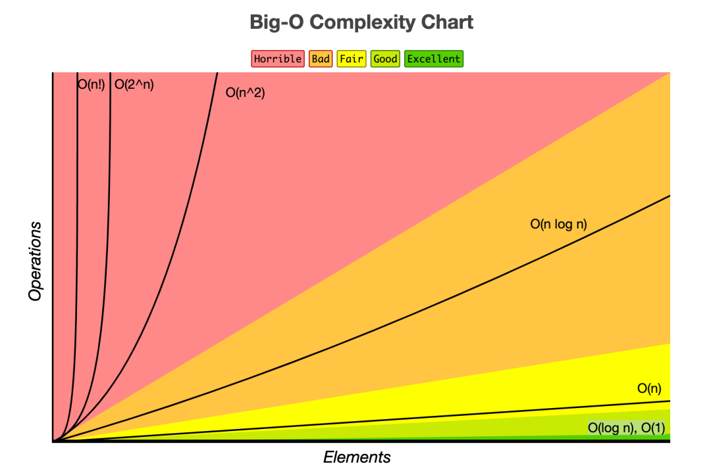
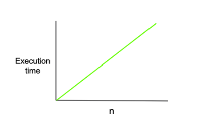
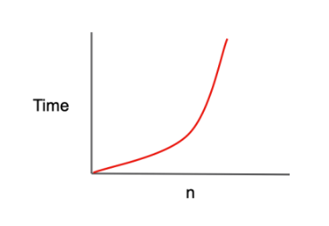
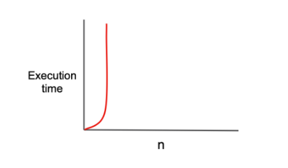

# 시간복잡도

시간 복잡도는 문제를 해결하는데 걸리는 시간과 입력의 함수 관계를 가리킵니다.
즉, **'입력값의 변화에 따라 연산을 실행할 때, 연산 횟수에 비해 시간이 얼마만큼 걸리는가?’**라는 말입니다.

효율적인 알고리즘을 구현한다는 것은 바꾸어 말해 입력값이 커짐에 따라 증가하는 시간의 비율을 최소화한 알고리즘을 구성했다는 이야기입니다.

주로 Big-O 표기법을 사용해 나타냅니다.

## Big-O 표기법

**시간 복잡도를 표기하는 방법**

- Big-O(빅-오) ⇒ 최악의 경우
- Big-Ω(빅-오메가) ⇒ 최상의 경우
- Big-θ(빅-세타) ⇒ 평균의 경우

**가장 자주 사용되는 표기법은?**

- Big-O 표기법은 최악의 경우를 고려하므로, 프로그램이 실행되는 과정에서 소요되는 최악의 시간까지 고려할 수 있기 때문입니다.

### Big-O 표기법의 종류

1. O(1)
2. O(n)
3. O(log n)
4. O(n^2)
5. O(2^n)


속도 : O(1) > O(log n) > O(n) > O(n^2) > O(2^n)

**1. O(1)**

O(1)는 일정한 복잡도(constant complexity)라고 하며, 입력값이 증가하더라도 시간이 늘어나지 않습니다.

```javascript
function O_1_algorithm(arr, index) {
  return arr[index];
}

let arr = [1, 2, 3, 4, 5];
let index = 1;
let result = O_1_algorithm(arr, index);
console.log(result); // 2
```

입력값의 크기가 아무리 커져도 즉시 출력값을 얻어낼 수 있습니다.

**2. O(n)**

O(n)은 선형 복잡도(linear complexity)라고 부르며, 입력값이 증가함에 따라 시간 또한 같은 비율로 증가하는 것을 의미합니다.

```javascript
function O_n_algorithm(n) {
  for (let i = 0; i < n; i++) {
    // do something for 1 second
  }
}

function another_O_n_algorithm(n) {
  for (let i = 0; i < 2n; i++) {
    // do something for 1 second
  }
}
```

O_n_algorithm 함수에선 입력값(n)이 1 증가할 때마다 코드의 실행 시간이 1초씩 증가합니다.

another_O_n_algorithm 함수에선 입력값이 1 증가할때마다 코드의 실행 시간이 2초씩 증가합니다.
그렇다면 이 알고리즘은 O(2n) 이라고 표현하겠구나!” 라고 생각할 수 있습니다.
사실 이 알고리즘 또한 Big-O 표기법으로는 O(n)으로 표기합니다.
입력값이 커지면 커질수록 계수(n 앞에 있는 수)의 의미(영향력)가 점점 퇴색되기 때문에, 같은 비율로 증가하고 있다면 2배가 아닌 5배, 10배로 증가하더라도 O(n)으로 표기합니다.

**3. O(log n)**

O(log n)은 로그 복잡도(logarithmic complexity)라고 부르며, Big-O표기법중 O(1) 다음으로 빠른 시간 복잡도를 가집니다.

이해하기 쉬운 게임으로 비유해 보자면 up & down을 예로 들 수 있습니다.
1~100 중 하나의 숫자를 플레이어1이 고릅니다. (30을 골랐다고 가정합니다.)
50(가운데) 숫자를 제시하면 50보다 작으므로 down을 외칩니다.
...반복...
경우의 수를 계속 절반으로 줄여나가며 정답을 찾습니다.

매번 숫자를 제시할 때마다 경우의 수가 절반이 줄어들기 때문에 최악의 경우에도 7번이면 원하는 숫자를 찾아낼 수 있게 됩니다.
BST(Binary Search Tree)의 값 탐색 또한 이와같은 로직으로, O(log n)의 시간 복잡도를 가진 알고리즘(탐색기법)입니다.

**4. O(n^2)**

O(n^2)은 2차 복잡도(quadratic complexity)라고 부르며, 입력값이 증가함에 따라 시간이 n의 제곱수의 비율로 증가하는 것을 의미합니다.

```javascript
function O_quadratic_algorithm(n) {
  for (let i = 0; i < n; i++) {
    for (let j = 0; j < n; j++) {
      // do something for 1 second
    }
  }
}

function another_O_quadratic_algorithm(n) {
  for (let i = 0; i < n; i++) {
    for (let j = 0; j < n; j++) {
      for (let k = 0; k < n; k++) {
        // do something for 1 second
      }
    }
  }
}
```

2n, 5n 을 모두 O(n)이라고 표현하는 것처럼, n^3과 n^5 도 모두 O(n^2)로 표기합니다.
n이 커지면 커질수록 지수가 주는 영향력이 점점 퇴색되기 때문에 이렇게 표기합니다.

**5. O(2^n)**

O(2^n)은 기하급수적 복잡도(exponential complexity)라고 부르며, Big-O 표기법 중 가장 느린 시간 복잡도를 가집니다.

```javascript
function fibonacci(n) {
  if (n <= 1) {
    return 1;
  }
  return fibonacci(n - 1) + fibonacci(n - 2);
}
```

재귀로 구현하는 피보나치 수열은 O(2n)의 시간 복잡도를 가진 대표적인 알고리즘입니다.
브라우저 개발자 창에서 n을 40으로 두어도 수초가 걸리는 것을 확인할 수 있으며, n이 100 이상이면 평생 결과를 반환받지 못할 수도 있습니다.

<hr/>

**참고링크**

- https://hanamon.kr/%EC%95%8C%EA%B3%A0%EB%A6%AC%EC%A6%98-time-complexity-%EC%8B%9C%EA%B0%84-%EB%B3%B5%EC%9E%A1%EB%8F%84/
- https://blog.chulgil.me/algorithm/
- https://ontheway.tistory.com/47
